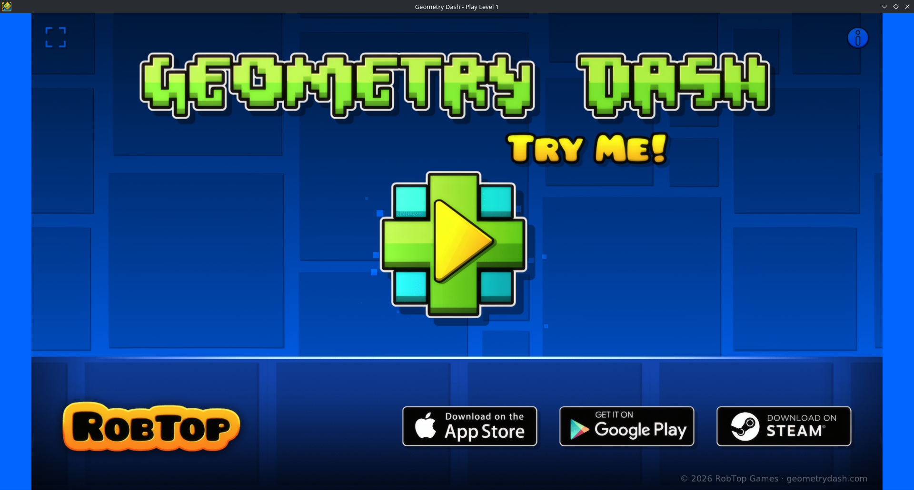

# Geometry Dash Web — Decompilation & Native C++ Port

<p align="center">
  
</p>


> # ⚠️ **Warning:** This project uses AI.
> Some people may not like AI at all for any purpose. If so, just ignore this project. Do not hate on it. I personally believe using AI for both decompilation and porting the entire engine to C++ is a completely valid use case, as doing either of these entirely by hand would take forever.

---

## 🎮 What is this project?

This repository contains two major milestones:
1. **The clean, reverse-engineered deobfuscation** of the official Geometry Dash web demo found on [geometrydash.com](https://geometrydash.com) (originally built on Phaser 3.90.0).
2. **A 100% standalone, lightweight native C++ port** built from scratch using **OpenGL 1.1** and **SDL2**, engineered specifically to run at hundreds of frames per second on ancient, low-end hardware (such as legacy netbooks, school laptops, and Intel Atom / GMA graphics).

---

## ⚡ The Native C++ / OpenGL 1.1 Engine 

Rather than relying on heavy modern engines (like Unity, Godot) or browser runtimes, the game logic was translated 1:1 into native C++ with a custom fixed-function pipeline renderer.

### Key Features
* **Legacy OpenGL 1.1 Pipeline:** Zero programmable shader requirements. Uses standard 2D orthographic projections, matrix stacks, and texture quads. Runs on practically any GPU manufactured in the last 20+ years.
* **1:1 Physics Reproduction (240 Hz Sub-stepping):** Faithfully mirrors RobTop’s physics model by sub-stepping delta time into 240 Hz slices. The cube, ship gravity, jump arcs, and rotation feel identical to the original game.
* **Native zlib Decompression:** Completely strips away the ~4,000 lines of JavaScript inflate/deflate code (Pako.js), replacing it with system-native `zlib` to decompress level strings instantly.
* **Low-Memory Audio (MP3 & OGG Vorbis):** Powered by `miniaudio` and `stb_vorbis` single-file libraries for lightweight background music streaming and zero-latency sound effects playback.
* **Complete Level Flow:** *Stereo Madness* is playable from start to finish:
  * Full main menu with responsive bouncy buttons and ambient particle glitter.
  * Iconic slide-in entrance animation rolling the cube onto the stage from the left.
  * Accurate 1:1 particles: continuous ground dust (30 Hz) and 10-particle landing impact bursts.
  * Smooth ship mode physics, custom streak trail emitting from the engine nozzle, and automatic ceiling bounds.
  * Dynamic color triggers, parallax background, and infinite carousel floor wrapping.
  * Level complete sequence with expanding additive shockwave rings and animated stat screens.

---

## 🛠️ Building & Running (Linux / Arch Linux)

### Prerequisites
Make sure you have GCC, Make, SDL2, Mesa (OpenGL), and zlib installed:

```bash
# Arch Linux
sudo pacman -S base-devel sdl2 mesa zlib
```

### Compile & Launch
The project uses a Makefile with automatic header dependency tracking (`-MMD -MP`):

```bash
# Compile using all CPU cores
make -j$(nproc)

# Run the game
./GeometryDash
```

---

## 📁 Repository Structure

```text
├── assets/                       # Spritesheets, audio, bitmap fonts, and level files
│   ├── GJ_WebSheet.png
│   ├── GJ_WebSheet.json
│   ├── 1.txt                     # Stereo Madness level data
│   ├── StereoMadness.mp3
│   └── *.ogg                     # Sound effects (explode_11, playSound_01, etc.)
│
├── src/                          # Native C++ Engine (OpenGL 1.1 + SDL2)
│   ├── main.cpp                  # Entry point, SDL window setup & letterbox viewport
│   ├── constants.h               # Shared tuning constants & 240Hz step definitions
│   ├── boot-scene.h / .cpp       # Asset preloader & OpenGL texture management
│   ├── font-helpers.h / .cpp     # BMFont (.fnt) parser & bitmap font quad renderer
│   ├── player-physics-state.h    # State machine (velocity, grounded, ship mode)
│   ├── level-data-helpers.h/.cpp # TexturePacker atlas UV lookup & LevelObject definitions
│   ├── pako-compression.h / .cpp # Native zlib level parser & object catalog
│   ├── level-renderer.h / .cpp   # Infinite carousel ground & spatial section batching
│   ├── trail-renderer.h / .cpp   # Additive motion trail ribbon for the ship
│   ├── sprite-layer-helper.h/.cpp# Multi-layer sprite depth/tint helper
│   ├── player.h / .cpp           # Cube/Ship controller, rotation & particle systems
│   ├── tween-value.h             # Color interpolation (Tween) engine
│   ├── color-manager.h / .cpp    # Background and ground color trigger transitions
│   ├── audio-manager.h / .cpp    # Music playback, volume fading & audio-beat metering
│   ├── game-scene.h / .cpp       # Main game loop, camera tracking, HUD & pause menus
│   ├── win-effects.h / .cpp      # Expanding shockwave rings & win celebration effects
│   ├── stb_image.h               # Public domain PNG image loader
│   ├── stb_vorbis.c              # Public domain OGG Vorbis decoder (for SFX)
│   └── miniaudio.h               # Lightweight audio playback library
│
└── Makefile                      # Incremental native build system
```

---

## 📜 History: The JavaScript Deobfuscation

The web version on `geometrydash.com` originally shipped as a single minified and obfuscated 56,000-line bundle (`index-game.js`). 

The initial phase of this project accomplished:
1. **Vendor Separation:** Isolating the unmodified official `phaser.min.js` (3.90.0) build from the actual game logic.
2. **Deobfuscation:** Resolving ~40,000 hex lookup calls (`_0x4e0e(...)`) into human-readable strings, method identifiers, and property keys.
3. **Dead-Code Elimination:** Stripping out leftover decoder tables, arrays, and dead execution branches.
4. **Scope-Aware Renaming:** Utilizing Babel AST traversals to rename obfuscated variables into semantically meaningful identifiers based on assignments and callback signatures.
5. **Modular Decomposition:** Splitting the monolithic script into 16 clean, Prettier-formatted ES files under `src/`.

---

## 🤝 Credits & Acknowledgements

* **RobTop Games:** Creator of Geometry Dash.
* **Phaser Studio:** Developers of the Phaser HTML5 game engine.
* **Original Decompilation Contributors:** For the initial extraction and reverse-engineering of the browser bundle.
* **stb & miniaudio contributors:** For providing the rock-solid single-header C libraries (`stb_image`, `stb_vorbis`, and `miniaudio`) powering texture loading and multi-format audio playback.
